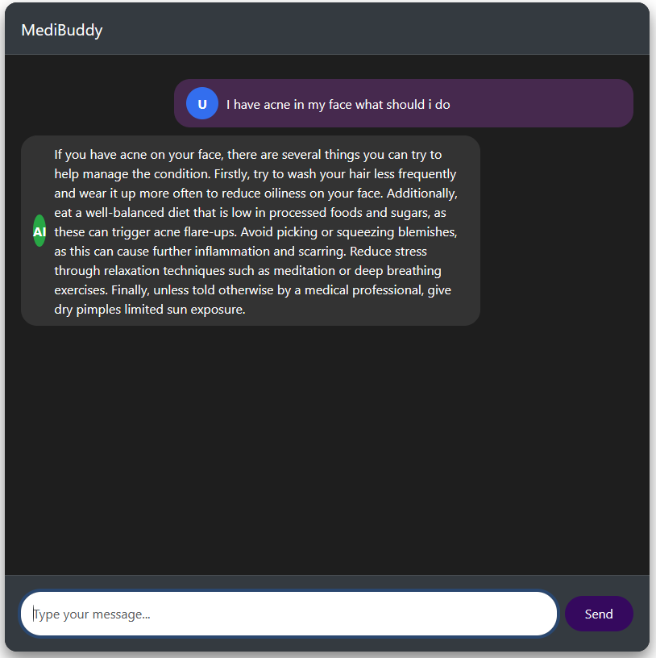
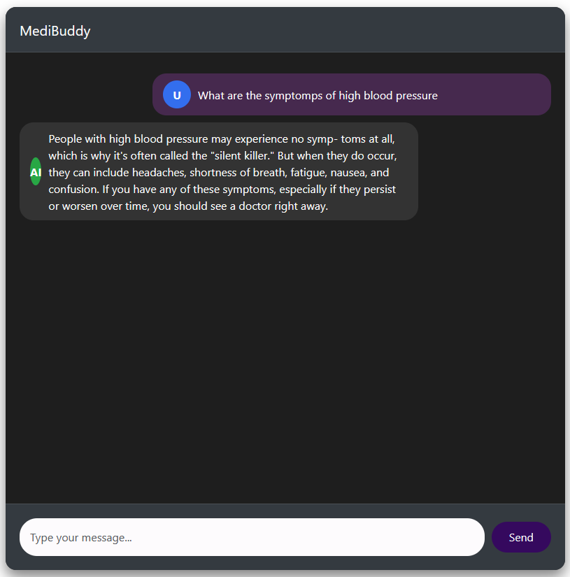
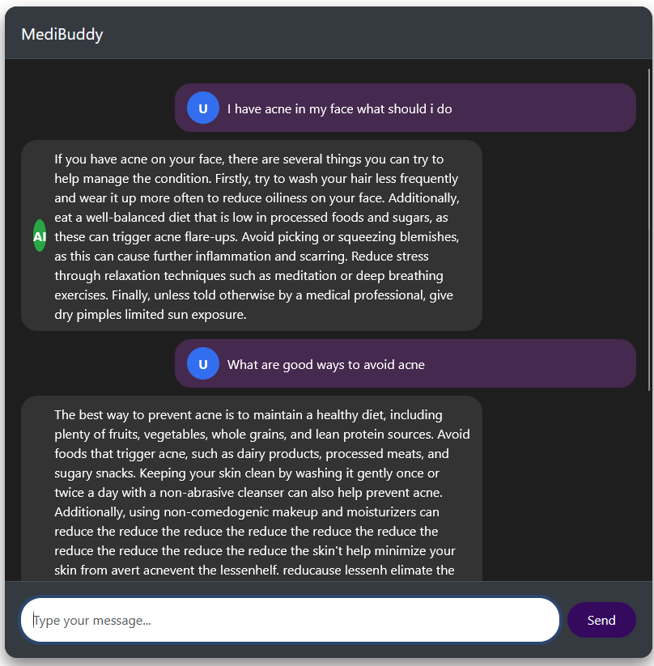
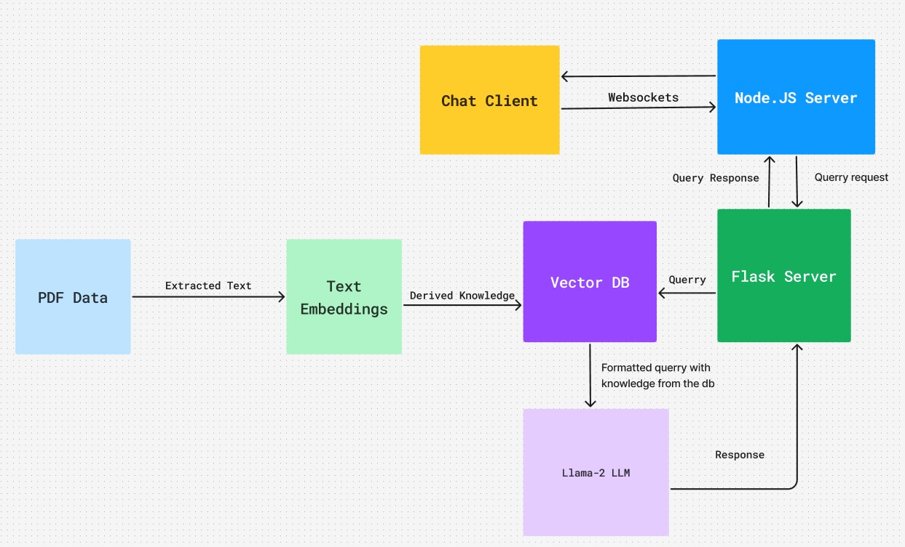

# RAG Based Medical ChatBot



This project uses Retrieval-Augmented Generation using ChromaDB as the knowledge store and Llama2 as the llm with a custom data set of medical books, to make a chatbot that can help you with quick diagonsis and/or first aid instructions and how to proceed further with medical advice

## Problem Statement
We live in a couuntry where the lack of accessible and reliable medical information hinders timely care. This project develops an AI chatbot using RAG and LLM's to deliver accuarate, context-aware medical guidance, improving global healthcare accessibility
## Proposed Solution
An AI-powered medical chatbot using LangChain, Flask APIs, and Meta LLaMA-2 for context-aware, accurate medical guidance. It leverages ChromaDB for efficient information retrieval, improving healthcare accessibility and decision-making.
## Project architecture

### Front end Chat client
The chat client uses a simple web socket architecture, with a basic client 
using html, css and js along with an express.js server to handle the communication between the user and the model. When the server recieves a message from the user, the server checks if the backend is online and if yes sends a request to the backend and sends the response back to the client.
### Backend Model
The backend model consists of an api designed in flask that has the endpoint `/ask` which expects a json body in the following format
```json
{
"question":"I am having high fever and runny nose"
}
```
The flask server sends the querry to ChromaDB which will provide us with information from our datasets that matches with the querry. The flask server then formats the querry and sends it to Llama2 with the appropriate information from ChromaDB. Then it formats the response given by Llama2 and sends it to the express.js server in the format given below
```json
{
"response":"Having high fever and runny nose is a ......"
}
```
## How to Install
First as always, you need to create a virual environment so that you path dependencies are not interfered
Command: `conda create -p medical_venv python==3.9`
Activate the virtual environment

`conda activate medical_venv`

Now that the virtul environment has been set up, install the libraries that are 
mentioned in the Requirements.txt file 

[Download this book](https://www.gale.com/ebooks/encyclopedia-of-medicine) as the dataset

The libraries that are needed for the functionality of the project are now installed.
You can import them into the notebook and start working